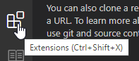
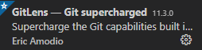
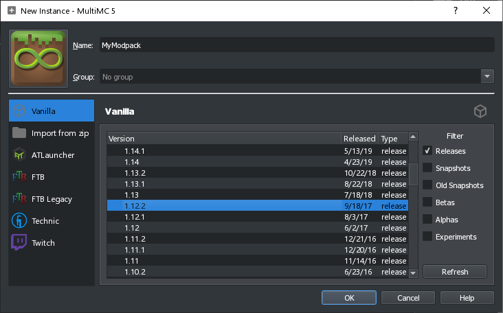

~~好吧，写这东西是因为实在无聊了~~

---

本文旨在分享一点本人在整合包开发方面的经验，大部分内容均为本人个人推荐.

面向无整合包开发经验，不知从何开始的初学者.

指南部分欢迎批评指正，感想部分不接受任何反驳.

本文同时包含简易创建并运用整合包GitHuib仓库的指南，也是本人强烈推荐进行的步骤。如果实在不方便访问GitHub，或就是对在GitHub开源耿耿于怀，可以跳过相关部分.

**阅读本文，代表您已经具有基本的科学上网能力，或能忍受经常通过大量的hCaptcha验证并有等待大量境外网站加载的耐心，亦或者你家网就是没啥问题，GitHub/CurseForge无压力.**

---

先讲点基础知识, 各种乱七八糟的.

魔改整合包聚集的版本大多是1.12.2和1.7.10. Mojang在这两个版本和下一个版本之间拖了很久, 此期间就产生了大量模组和此版本玩家. 于是，这两个版本的模组较多, 玩家也多, 且是两大魔改基础模组[CraftTweaker](https://www.curseforge.com/minecraft/mc-mods/crafttweaker)(下文简称CrT)和[MineTweaker3](https://www.curseforge.com/minecraft/mc-mods/minetweaker3)(下文简称MT)的老家,也理所应当的成为了魔改整合包聚集最多的两个版本. 至于很多人仍然忠于1.7.10，每个人的理由都不同, 本人仍偶尔玩1.7.10的原因则是很多老牌模组(如Reika全家桶, GregTech5,6).

CrT和MT都使用一门封装语言ZenScript(下文简称ZS)作为底版, 你需要通过编写ZenScript代码, 使用各个模组提供的Method(方法)和你自己的脑子来实现你想要的功能.

1.12.2请使用CrT，1.7.10请使用MT. 不是说1.12.2没有MT，也不是说1.7.10没有CrT，是因为这两个模组在对应的版本发挥最好，在其它版本多少沾点瘸腿(CrT除外，其在更高版本上也是首选).

以及一些几乎必装的附属/推荐模组:

Crt：[ContentTweaker](https://www.curseforge.com/minecraft/mc-mods/contenttweaker)(下文简称CoT),允许你简单创建自定义物品，方块等游戏内容；[ModTweaker](https://www.curseforge.com/minecraft/mc-mods/modtweaker), 为CrT添加更多模组兼容.

MT：[CustomStuff3](https://www.curseforge.com/minecraft/mc-mods/custom-stuff-3)(下文简称CS3), 和CoT差不多, 但其在1.12.2的延续版CS4十分拉跨，不推荐使用；另外，1.7.10也有ModTweaker，功能相同.

ZenScript是一门封装语言, 本身并不是很难学习(其实也没太多好学的), 重要的是你如何灵活运用各种Method. 最终目的固然是实现你想要的功能, 但追求代码整洁高效也是很有意思的.

再谈谈Pastebin(Ubuntu Pastebin, paste.ee等), 其作用是快捷方便的分享代码/日志片段给他人, 便于求助等用途, 而免受接收多个无用文件之苦，请灵活运用Pastebin, 共同创建一个更加美好的世界.

不多累赘，下面正文.

---

**1. 挑选工具，搭建环境**

开发整合包最常用，也是本人在使用/强力推荐的文本编辑器，既是[Visual Studio Code (VSCode)](https://code.visualstudio.com/), 一款微软提供的, 基本写什么都很好用的免费文本编辑器, 只要安装某昨开发的ZenScript拓展, 即可获得代码高亮. 如果偏要问高亮是什么，大致就是你看别人写码时屏幕上花花绿绿的文本上色, 这些上色是有规律的, 可以协助你阅读和编写代码.

1. 安装方面不多赘述, 在VSCode官网下载并安装即可
2. 启动VSCode, 点击进入左方的拓展菜单



3. 依次搜索并安装ZenScript(yesterday17), ~~Rainbow Brackets(2gua)~~, Minecraft Lang Colorizer(zz5840)和mcmeta(xTeal). 如有需要可另外安装GitLens-Git supercharged(Eric Amodio)和Tabnine Autocomplete(TabNine)

VSCode 在 Aug 2021 更新中内置了[括号颜色配对](https://code.visualstudio.com/updates/v1_60#_high-performance-bracket-pair-colorization), 无需再额外安装 Rainbow Brackets 插件.

<!--

-->




4. 重启VSCode, 享受代码高亮

**不要使用Notepad++和Windows自带的记事本写代码，眼睛会瞎，向别人寻求帮助时也很难得到答复.**

接着是启动器(我也不知道我为什么没先写启动器), 选择启动器取决于你是否有稳定科学上网能力和是否拥有Java版正版账号，如果你同时拥有两者, 那么首选固然是[MultiMC](https://multimc.org/)，功能强大的启动器, 只不过只有登陆正版后才能启动游戏. 退而求其次，或者你就是喜欢/习惯，可以使用[HMCL](https://github.com/huanghongxun/HMCL/releases)，同样是不错的启动器，但本人更倾向于前者的实例管理系统。

然后是可选的GitHub仓库, 在你跳过前，容我介绍一下创建并运用GitHub仓库的好处：

1. Commit History系统可以帮助你查询，对比历史代码.
2. 便于团队协作开发.
3. 不必使用PasteBin, 可以直接使用仓库对应文件的链接分享代码(别把日志也搞上来)。

如果你对以上好处都不感兴趣也不在乎，那你可以跳过这一部分了.

*有关联动GitHub Action进行打包的新架构方案, 见[aboutMMCPlusGithub.md](https://github.com/GBLodb/GBLodb/blob/main/aboutMMCPlusGithub.md).*

首先安装一个Git图形端, 本人推荐[SourceTree](https://www.sourcetreeapp.com/), 但其实[GitHub Desktop](https://desktop.github.com/)也够用.

接下来，创建Github仓库，进入GitHub主页面，点击"New".


在Repository Name中输入你整合包的名称, 简介要不要写可选，选中Public.


勾选"Add a README file", "Choose a license", 此处选择GNU GPLv3. 当然你也可以选择其他协议，或取消勾选"Choose a license", 日后自行添加其他自定义协议文件. 点击Create repository, 创建仓库.


接下来，在MultiMC中创建同名实例.



接下来，进入SourceTree界面,点击Clone


输入你仓库的地址，将路径设置为MultiMC示例文件夹里的同名文件夹\\.minecraft，名称设置为你整合包的名称, 点击Clone.


接着在.minecraft目录下创建.gitignore文件.


输入以下内容，保存.

```
$ cat .gitignore
#Whitelist
*
!*/

#Folders
!/config/**
!/patchouli_books/**
!/resources/**
!/scripts/**
!/structures/**

#Files
!/.gitignore
!/README.md
````

打开SourceTree, 点击StageAll.


写明你对仓库所做的更改，点击Commit.


最后点击Push，你的更改就推送到仓库里了.


仓库部分至此完成，日后可以通过同样的操作进行commit并push.

团队协作时，如需要获取别人的改动，点击Pull即可.


日后开发中，使用VSCode打开.minecraft文件夹，再进行编辑即可.

---


### Part.2: 如何构思一个魔改整合包

&nbsp;&nbsp;&nbsp;&nbsp;&nbsp;&nbsp;&nbsp;&nbsp;如何构思一个魔改整合包是一个很难展开的话题，我很久之前就想总结点东西出来，这次算是有了灵感。我的出发点是：“万事得有个根据”。

&nbsp;&nbsp;&nbsp;&nbsp;&nbsp;&nbsp;&nbsp;&nbsp;&nbsp;&nbsp;&nbsp;&nbsp;构思一个魔改整合包这个事儿和创造性写作有很多相似点，但有不尽相同。创造性写作允许存在没有根据的东西，而构思整合包不允许，因为每个点子最后都要落实到冷冰冰的代码上，计算机无法计算没有根据的东西，有根据的基础上才能继续延伸。

&nbsp;&nbsp;&nbsp;&nbsp;&nbsp;&nbsp;&nbsp;&nbsp;进入正题，从初稿说起，初稿构思应该遵循极简主义，这话什么意思呢，也就是你在初稿需要定下一个明确的方向，也就是其最完美的状态，受众，只保留最原创，精华的特点，这叫做极简的初稿。定下大方向后，再围绕这一大方向构建整个包。先搭建骨架，再填充皮肉，大方向重点在于要明确，而不一定要大众。每个人的想法都不一样 玩家早已熟悉模组本身的玩法 玩家玩一个包应该是为了一个包的特殊地方 这特殊地方应该是你原创的游戏内容 而不是硬生生的把模组之间通过几个破配方粘合在一起。你有自己的喜好，玩家也都有自己的喜好，硬要符合玩家的需求在绝大部分时候是不必要的。整合包的特殊原创设定应该是吸引兴趣相同的人，而不是尽量去满足任何人的需求，这很累人，也不现实。创作者和玩家是平等的，你在与玩家的讨论中并没有什么特权。

&nbsp;&nbsp;&nbsp;&nbsp;此处并不是想要吐槽那些模组很多受众很广，原创内容偏少的整合包。这也是一种很多人所爱的兴趣，兴趣之间没有什么高低贵贱，只有你喜欢我不喜欢，我喜欢你不喜欢。重要的是，不要为了满足别人而创作，你靠那些违背自己意愿得来的受众，是要靠持续的违心的行为保留的，这不会长久，不要设计连你自己都完全不想玩的东西。有句话说的好，一个谎需要另一个谎来圆。和生活中一样，靠人格面具维持的朋友关系是令人精疲力尽的，且不会长久的。

&nbsp;&nbsp;&nbsp;&nbsp;说回正题，定下明确的大方向后，接着就该围绕这一大方向构建整个整合包了。先搭建骨架 再填充皮肉，大方向在要明确，不一定要大众的前提上，也不一定要内涵丰富，剧情、复杂的背景故事和世界观就是一个很好的例子。作为一个MC整合包，你的体量是十分有限的，圈子的体量和活跃度也是有限的，如果你没有能力，或你的想法要远远大于整合包这一载体的能力或圈子的体量，那么这个想法就不务实，缺少被实现的意义。不应该别总是想着营造一些自己都说不清楚的虚无缥缈的“深度”。只要做到以上几点，你就能搭建一具牢固的“大方向”骨架。反之 这骨架就随时可能因为各种原因散落在地：比如海啸、地震、火山喷发、以及你的自卑爆发。

&nbsp;&nbsp;&nbsp;&nbsp;说回到构思，在初稿完工后，多花点时间去修饰它完善它。也许你有过写下一篇文章，在自己重读的头几遍里，每一遍都觉得还有很多可以改进的地方。所谓不要过于相信第一时间出现的灵感，它们很可能是不现实的、不确切的。有的需要继续打磨，有的甚至荒唐可笑，这在构建骨架的时候是大忌。

&nbsp;&nbsp;&nbsp;&nbsp;构建完骨架 思维就该从“没了就不合适”切换到“有了更合适”上，开始填充皮肉。两者的区别在于前者是必不可少，后者更倾向于锦上添花。在添加细节等时，要遵循“如无必要,勿增实体”的奥卡姆剃刀原则，也就是仍在一定程度上追寻极简，这在构思工作量和后期实现工作量上都是一件喜人的事儿。如果你的构思里也有一个添加了废柴二次元女仆的 Beta 阶段，本人在这里以个人名义建议你三思。我为什么要说“也”？我也不知道。

&nbsp;&nbsp;&nbsp;&nbsp;回到正题，在填充皮肉这一过程中，切忌犯完美主义错误，即不该追求不可能的事情。这个世界上不存在完美的设定，除非你写整合包纯粹是个人用途，那就当我没说。 (但实际上就算是写给自己女生自用的设定，也不总是能达到自己心里的完美，不是吗？）当你在为你的大方向骨架填充细节时，一定要记住大方向在构思中永远可以随时改变，但容易牵一发动全身，最好还是在构思前期定死大方向。但如果你的包从某种程度上抄袭了赛文科技，那也当我没说，抄袭不需要缜密构思 别人的大脑已经帮你的大脑代劳了。我为什么要提赛文科技? 我也不知道，随便想到什么包我就说什么了，可能是因为赛文太有名了，论谁谁都想抄吧。

&nbsp;&nbsp;&nbsp;&nbsp;再次回到正题，当你确信你已经为你的大方向骨架填充了一定量的细节后，下面是奖励关卡：找一位你的朋友，把你初具人性的设定送审，听听别人的看法，但没必要全盘接受。这是改进路上必不可少的关卡。但一定要时刻记住：你咨询别人不是为了让人家和你在一些主观话题上争执,关键的地方需要自己动脑想,而不是全靠别人帮你想，否则你的作品就永远没有自己的闪光点，泯然众人。你和对方讨论的理应是思路和灵感，不是确切的方案和执行方法。这就是创造性和执行性的区别，村上春树说过，他写小说最忌讳的就是先给自己搭建框架，因为这样会极大程度的限制自己的发挥。这种需要自己思考的创造性的东西你问别人就和给自己假设严密的框架是一样的，你把被问的人视作权威，这没什么问题。但权威在这种方面上最好只给你提供一些最基本的思路和很难思考的问题的参考答案，否则你将逐渐失去你的特点和创造力，这是坏的，没有任何好处。

&nbsp;&nbsp;&nbsp;&nbsp;讲了这么多构思，本人觉得比较重要的一些点也都讲的差不多了。本人水平也有限，在思路上莫非是整理总结了一些个人经验，且在他人的帮助下完善了部分论点。如果能帮到你，那就最好了，如果你觉得我讲的狗屁不通，那你也有你的道理。

&nbsp;&nbsp;&nbsp;&nbsp;就这样，不多赘述了，以上。

